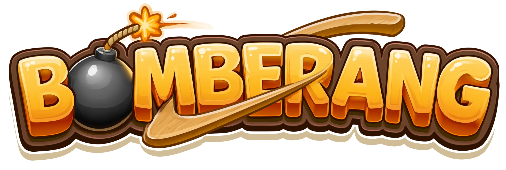
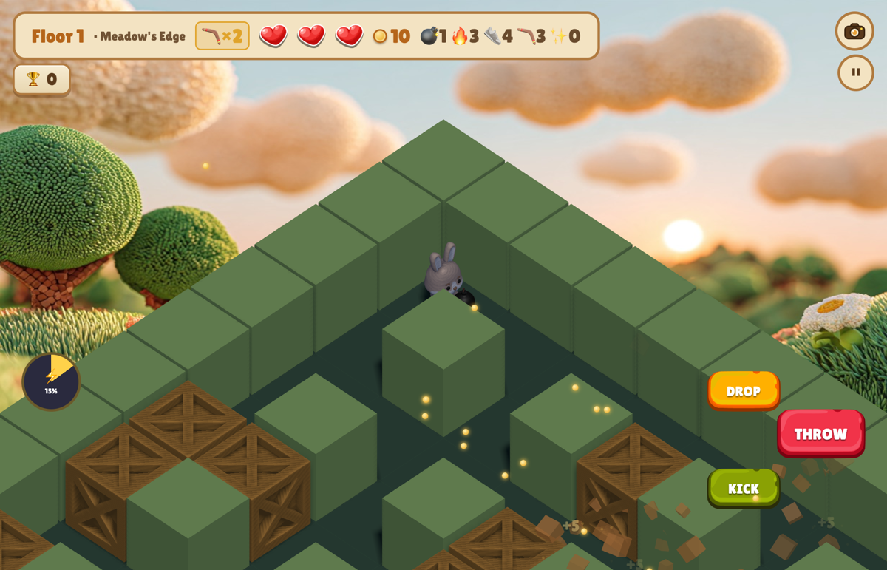
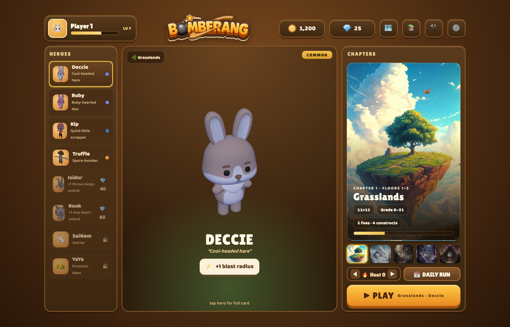
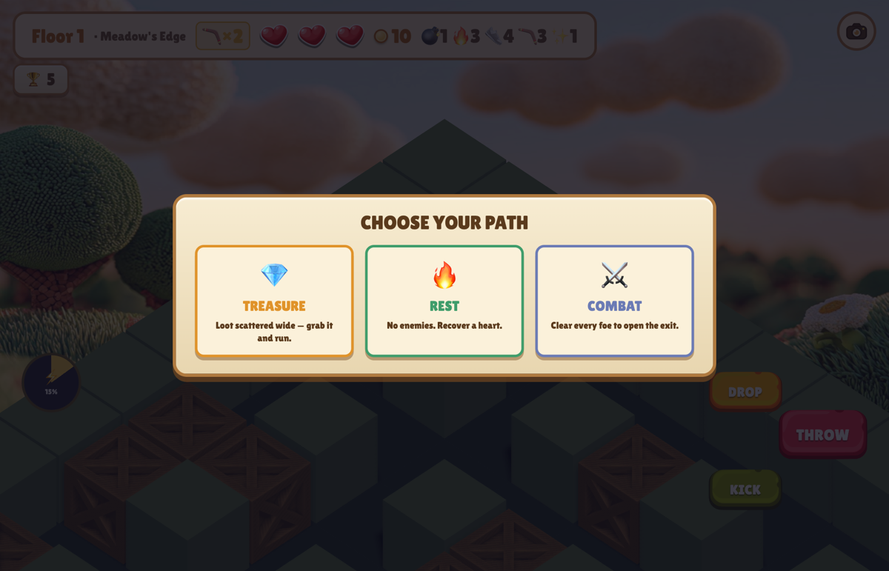

<h1 align="center">💣 BOMBERANG 🪃</h1>

<b>THE BOMB COMES BACK</b>

  

  
  &nbsp;
  

---

## Bomberman, but your bombs are boomerangs.

Every bomb you throw **arcs out and comes back**. Lead your targets, bank shots
around corners, catch the return — or get caught in your own blast. Drop, throw,
and **kick** live bombs down corridors to crack open the maze.

Then pick a door and go deeper. **BOMBERANG** is a roguelite climb through five
Acts to the Dread Keep: clear the room, choose your path, bank relics, and fall
forward — every run banks gems toward a stronger next climb.

  

## Why you'll stay

- 🪃 **Boomerang bombs** — the throw is the skill. Arc, bank, catch, re-throw.
- 🚪 **Pick your path** — Combat · Elite · Treasure · Rest · Merchant · Rescue.
- ✨ **Relics stack** — Wide Blast, Catcher's Mitt, Rocket Arm, Bomb Bandolier…
- 👑 **Five Acts, five World Bosses** — Grasslands → Frostpeak → Deep Mine → Crystal Cavern → The Keep.
- 🐰 **A roster with real kits** — each hero has a passive *and* a signature Ultimate.
- 🔥 **Heat & a Daily seed** — one shared maze a day, climb the ladder.
- 💎 **Premium, not predatory** — buy it once. No ads, no IAP, no energy timers.

  
  

## ⬇️ Play now

| | Platform | |
| :--: | --- | --- |
| ▶️ | **Play in your browser** — no download | **[bomberang.com](https://bomberang.com)** |
| 🌐 | **Web build** (self-hosted) | **[Download](https://github.com/jyswee/bomberang/releases/latest)** |
| 🍎 | iOS | *TestFlight — coming soon* |
| 🍏 🪟 🐧 | macOS · Windows · Linux | *coming soon* |

---

## Notice of rights

**BOMBERANG™** and the BOMBERANG logo are unregistered trade marks of
**Tyga.Cloud Ltd**, used in connection with downloadable and online computer
game software.

The game, its code, artwork, characters, audio, level designs and all other
content are **© 2026 Tyga.Cloud Ltd. All rights reserved.** No licence is
granted by the publication of this repository.

This repository exists as a **public, dated record** of the work and of the mark
as used. First public release: **2026-10-06** (see
[Releases](https://github.com/jyswee/bomberang/releases) — each release is
timestamped by GitHub and lists the build published on that date).

© 2026 Tyga.Cloud Ltd · BOMBERANG is a division of Tyga.Cloud Ltd

